# 第2章  文本分类
&emsp;&emsp;文本分类是 NLP 中最常见的任务之一；它可以用于广泛的应用，例如将客户反馈标记到类别中，或根据支持票证的语言对其进行路由。您的电子邮件程序的垃圾邮件过滤器很可能正在使用文本分类来保护您的收件箱免受大量垃圾邮件的侵害！

&emsp;&emsp;另一种常见的文本分类类型是情感分析，它（正如我们在第 1 章中所见）旨在识别给定文本的极性。例如，像特斯拉这样的公司可能会分析 Twitter 帖子，以确定人们是否喜欢其新车顶。


&emsp;&emsp;现在想象一下，您是一位数据科学家，需要构建一个系统，可以自动识别人们在 Twitter 上表达的关于您公司产品的情绪状态，例如“愤怒”或“喜悦”。在本章中，我们将使用 BERT 的一个变体 DistilBERT 来处理这项任务。该模型的主要优点是它可以实现与 BERT 相当的性能，同时体积更小、效率更高。这使我们能够在几分钟内训练一个分类器，如果您想训练一个更大的 BERT 模型，您只需更改预训练模型的检查点即可。检查点对应于加载到给定 Transformer 架构中的一组权重。

&emsp;&emsp;这也是我们第一次接触 Hugging Face 生态系统中的三个核心库：Datasets、Tokenizers 和 Transformers。如图 2-2 所示，这些库将使我们能够快速地从原始文本过渡到可用于对新推文进行推理的微调模型。因此，本着擎天柱的精神，让我们深入研究，“变形，出发！”
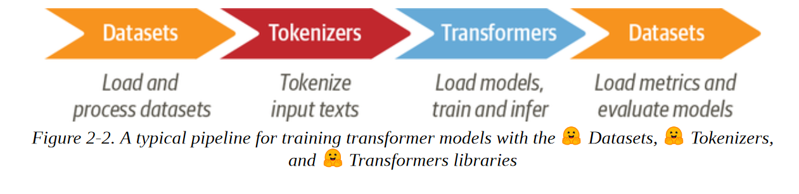

## 数据集
&emsp;&emsp;为了构建我们的情绪检测器，我们将使用一篇探索情绪如何在英语 Twitter 消息中表示的文章中的一个很棒的数据集。与大多数只涉及“积极”和“消极”极性的情感分析数据集不同，这个数据集包含六种基本情绪：愤怒、厌恶、恐惧、喜悦、悲伤和惊讶。给定一条推文，我们的任务将是训练一个模型，可以将其分类为这些情绪之一。

### 概览 Hugging Face 数据集
&emsp;&emsp;我们将使用 Datasets 从 Hugging Face Hub 下载数据。我们可以使用 list_datasets() 函数查看 Hub 上有哪些数据集可用：

```
from datasets import list_datasets 
all_datasets = list_datasets() 
print(f"There are {len(all_datasets)} datasets currently available on the Hub") 
print(f"The first 10 are: {all_datasets[:10]}") 

---------输出 -------------------
There are 1753 datasets currently available on the Hub The first 10 are: ['acronym_identification', 'ade_corpus_v2', 'adversarial_qa', 'aeslc', 'afrikaans_ner_corpus', 'ag_news', 'ai2_arc', 'air_dialogue', 'ajgt_twitter_ar', 'allegro_reviews']

```
&emsp;&emsp;我们看到每个数据集都有一个名称，因此让我们使用 load_dataset() 函数加载情绪数据集：

```
from datasets import load_dataset
emotions = load_dataset("emotion")

```
如果我们查看 emotions 对象的内部：

```
emotions 
DatasetDict(
{ 
train: Dataset({ features: ['text', 'label'], num_rows: 16000 }) 
validation: Dataset({ features: ['text', 'label'], num_rows: 2000 }) 
test: Dataset({ features: ['text', 'label'], num_rows: 2000 }) 
}
)

```

我们看到它类似于 Python 字典，每个键对应于不同的拆分。我们可以使用通常的字典语法来访问单个拆分：

```
train_ds = emotions["train"]

train_ds 

Dataset({ features: ['text', 'label'], num_rows: 16000 })

```

它返回 Dataset 类的实例。Dataset 对象是 Datasets 中的核心数据结构之一，我们将在本书的整个过程中探索它的许多特性。首先，它的行为类似于普通的 Python 数组或列表，因此我们可以查询它的长度：

```
len(train_ds) 

16000

```

或者通过其索引访问单个示例：

```
train_ds[0] 

{'label': 0, 'text': 'i didnt feel humiliated'}

```

在这里，我们看到单个行表示为一个字典，其中键对应于列名：

```
train_ds.column_names

['text', 'label']

```

值是推文和情绪。这反映了 Datasets 基于 Apache Arrow 的事实，Apache Arrow 定义了一种比原生 Python 更节省内存的类型化列格式。我们可以通过访问 Dataset 对象的 features 属性来查看底层使用的数据类型：

```
print(train_ds.features)

{'text': Value(dtype='string', id=None), 'label': ClassLabel(num_classes=6, names=['sadness', 'joy', 'love', 'anger', 'fear', 'surprise'], names_file=None, id=None)}

```

在这种情况下，text 列的数据类型是字符串，而 label 列是一个特殊的 ClassLabel 对象，它包含有关类名及其与整数映射的信息。我们还可以使用切片访问多行：

```
print(train_ds[:5])

{'text': ['i didnt feel humiliated', 'i can go from feeling so hopeless to so damned hopeful just from being around someone who cares and is awake', 'im grabbing a minute to post i feel greedy wrong', 'i am ever feeling nostalgic about the fireplace i will know that it is still on the property', 'i am feeling grouchy'], 'label': [0, 0, 3, 2, 3]}

```

请注意，在这种情况下，字典值现在是列表而不是单个元素。我们也可以按名称获取整列：

```
print(train_ds["text"][:5]) 

['i didnt feel humiliated', 'i can go from feeling so hopeless to so damned hopeful just from being around someone who cares and is awake', 'im grabbing a minute to post i feel greedy wrong', 'i am ever feeling nostalgic about the fireplace i will know that it is still on the property', 'i am feeling grouchy']

```

现在我们已经看到了如何使用 Datasets 加载和检查数据，让我们对推文的内容进行一些检查。


### 如果我的数据集不在 Hub 上怎么办？

在本书的大多数示例中，我们将使用 Hugging Face Hub 下载数据集。但在很多情况下，您会发现自己使用的是存储在笔记本电脑或组织的远程服务器上的数据。Datasets 提供了几个加载脚本来处理本地和远程数据集。表 2-1 显示了最常见数据格式的示例。

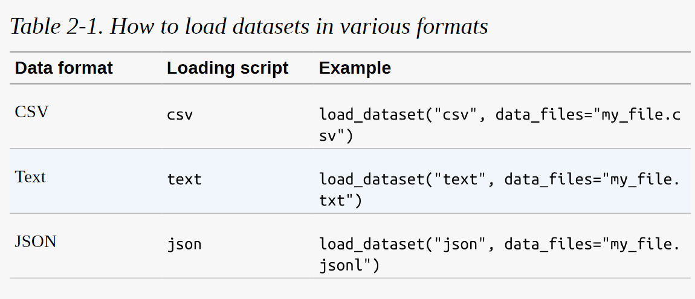

如您所见，对于每种数据格式，我们只需要将相关的加载脚本传递给 load_dataset() 函数，以及一个 data_files 参数，该参数指定一个或多个文件的路径或 URL。例如，情绪数据集的源文件实际上托管在 Dropbox 上，因此加载数据集的另一种方法是首先下载其中一个拆分：

```
dataset_url = "https://www.dropbox.com/s/1pzkadrvffbqw6o/train.txt" 

!wget {dataset_url} 
```

如果您想知道为什么前面的 shell 命令中有一个 ! 字符，那是因为我们在 Jupyter 笔记本中运行命令。如果您想在终端中下载和解压缩数据集，只需删除前缀即可。现在，如果我们查看 train.txt 文件的第一行：

```
!head -n 1 train.txt 

i didnt feel humiliated;sadness

```

我们可以看到这里没有列标题，每个推文和情绪都用分号隔开。尽管如此，这与 CSV 文件非常相似，因此我们可以使用 csv 脚本并将 data_files 参数指向 train.txt 文件来本地加载数据集：

emotions_local = load_dataset("csv", data_files="train.txt", sep=";", names=["text", "label"]) 

在这里，我们还指定了分隔符的类型和列的名称。更简单的方法是将 data_files 参数直接指向 URL 本身：

 dataset_url = "https://www.dropbox.com/s/1pzkadrvffbqw6o/train.txt?dl=1" 

emotions_remote = load_dataset("csv", data_files=dataset_url, sep=";", names=["text", "label"]) 

这将自动为您下载并缓存数据集。如您所见，load_dataset() 函数非常通用。我们建议您查看 Datasets 文档以获得完整概述。

## 从 Datasets 类 到 DataFrames 类

尽管 Datasets 提供了许多用于切片和分割数据的低级功能，但将 Dataset 对象转换为 Pandas DataFrame 通常很方便，这样我们就可以访问用于数据可视化的高级 API。为了实现转换，Datasets 提供了一个 set_format() 方法，允许我们更改 Dataset 的输出格式。请注意，这不会更改底层数据格式（它是 Arrow 表），您可以在需要时切换到另一种格式：

```
import pandas as pd 
emotions.set_format(type="pandas") 
df = emotions["train"][:] 
df.head()

```

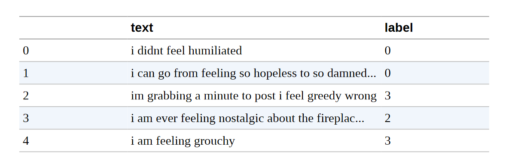

如您所见，列标题已保留，前几行与我们之前的数据视图匹配。但是，标签表示为整数，因此让我们使用 label 特性的 int2str() 方法在我们的 DataFrame 中创建一个新列，其中包含相应的标签名称：

```
def label_int2str(row): 
	return emotions["train"].features["label"].int2str(row) 
df["label_name"] = df["label"].apply(label_int2str) 
df.head()

```

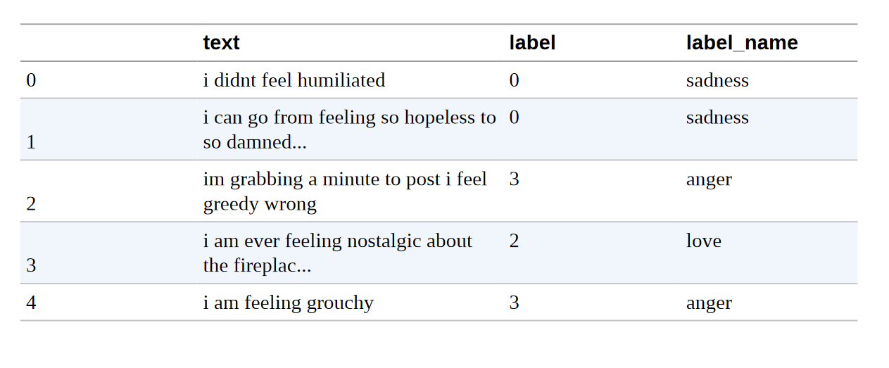

在深入构建分类器之前，让我们仔细看看数据集。正如 Andrej Karpathy 在他著名的博客文章“训练神经网络的秘诀”中指出的那样，“与数据合一”是训练优秀模型的关键步骤！

### 查看类分布

每当您处理文本分类问题时，最好检查类之间的示例分布。具有偏斜类分布的数据集可能需要在训练损失和评估指标方面进行与平衡数据集不同的处理。

使用 Pandas 和 Matplotlib，我们可以快速可视化类分布，如下所示：

```
import matplotlib.pyplot as plt
df["label_name"].value_counts(ascending=True).plot.barh() 
plt.title("Frequency of Classes") 
plt.show()

```

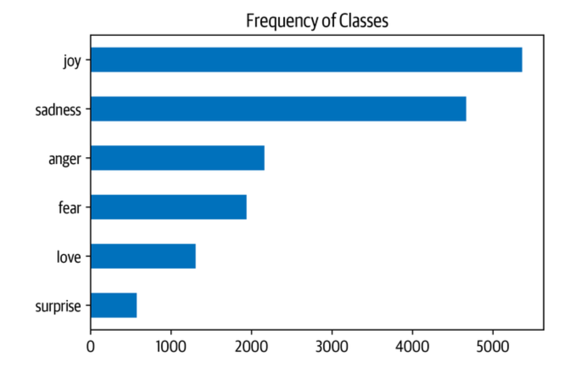

在这种情况下，我们可以看到数据集严重不平衡；joy 和 sadness 类经常出现，而 love 和 surprise 则要稀有 5-10 倍。处理不平衡数据有几种方法，包括：

- 随机过采样少数类。
- 随机欠采样多数类。
-  从代表性不足的类中收集更多标记数据。


为了在本章中保持简单，我们将使用原始的、不平衡的类频率。如果您想了解更多关于这些采样技术的信息，我们建议您查看 Imbalanced-learn 库。只需确保在创建训练/测试拆分之前不要应用采样方法，否则它们之间会发生大量泄漏！


现在我们已经查看了类，让我们看看推文本身。


### 我们的推文有多长？

Transformer 模型有一个最大输入序列长度，称为最大上下文大小。对于使用 DistilBERT 的应用程序，最大上下文大小为 512 个词token，相当于几段文本。正如我们将在下一节中看到的那样，词token是文本的原子部分；现在，我们将词token视为单个单词。我们可以通过查看每条推文的单词分布来粗略估计每种情绪的推文长度：


```
df["Words Per Tweet"] = df["text"].str.split().apply(len) 
df.boxplot("Words Per Tweet", by="label_name", grid=False, showfliers=False, color="black") 
plt.suptitle("") 
plt.xlabel("") 
plt.show()

```

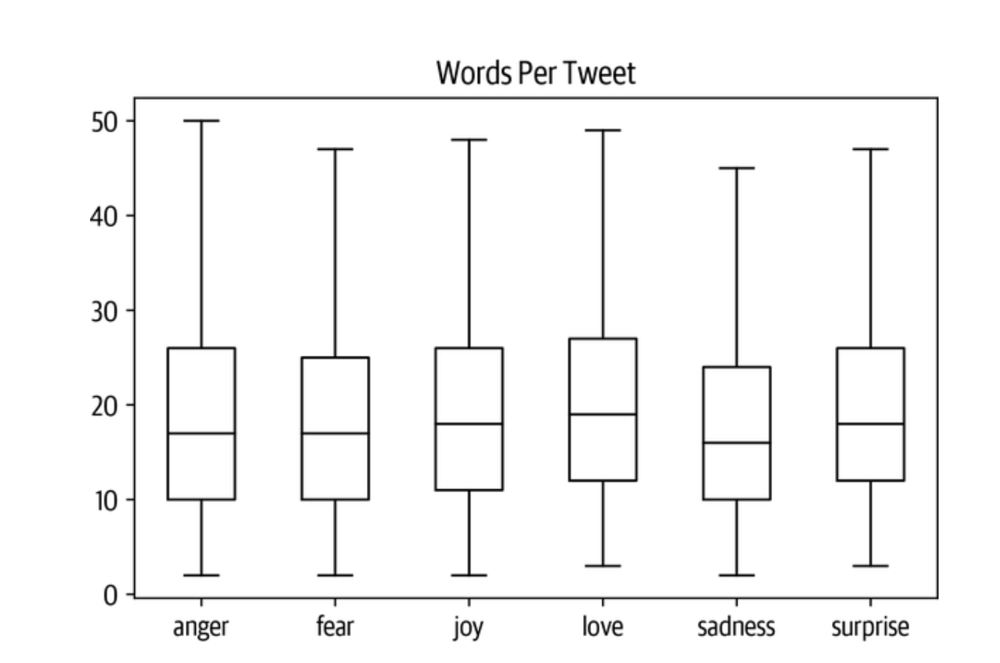

从图中我们可以看到，对于每种情绪，大多数推文的长度约为 15 个单词，最长的推文也远低于 DistilBERT 的最大上下文大小。如果文本长度超过模型的上下文大小，则需要截断文本，如果截断的文本包含关键信息，这可能会导致性能下降；在这种情况下，这似乎不是问题。

现在让我们弄清楚如何将这些原始文本转换为适合 Transformers 的格式！在此过程中，我们还要重置数据集的输出格式，因为我们不再需要 DataFrame 格式：

```
emotions.reset_format()
```


## 从文本到词 Token

像 DistilBERT 这样的 Transformer 模型不能接收原始字符串作为输入；相反，它们假设文本已被词tokenizer化并编码为数值向量。词tokenizer化是将字符串分解为模型中使用的原子单元的步骤。可以采用几种词tokenizer化策略，将单词最佳地拆分为子单元通常是从语料库中学习的。在查看 DistilBERT 使用的词tokenizer 之前，让我们考虑两个极端情况：字符词tokenizer化和单词词tokenizer化。

### 字符词tokenizer化

最简单的词tokenizer化方案是将每个字符单独馈送到模型中。在 Python 中，str 对象实际上是底层的数组，这使我们能够仅用一行代码快速实现字符级词tokenizer化：


```
text = "Tokenizing text is a core task of NLP."
tokenized_text = list(text) 
print(tokenized_text) 
['T', 'o', 'k', 'e', 'n', 'i', 'z', 'i', 'n', 'g', ' ', 't', 'e', 'x', 't', ' ', 'i', 's', ' ', 'a', ' ', 'c', 'o', 'r', 'e', ' ', 't', 'a', 's', 'k', ' ', 'o', 'f', ' ', 'N', 'L', 'P', '.']

```

这是一个好的开始，但我们还没有完成。我们的模型期望每个字符都被转换为整数，这个过程有时称为数值化。一种简单的方法是使用唯一的整数对每个唯一的词token（在这种情况下为字符）进行编码：

```
token2idx = {ch: idx for idx, ch in enumerate(sorted(set(tokenized_text)))} 
print(token2idx) 
{' ': 0, '.': 1, 'L': 2, 'N': 3, 'P': 4, 'T': 5, 'a': 6, 'c': 7, 'e': 8, 'f': 9, 'g': 10, 'i': 11, 'k': 12, 'n': 13, 'o': 14, 'r': 15, 's': 16, 't': 17, 'x': 18, 'z': 19}

```

这为我们提供了词汇表中每个字符到唯一整数的映射。我们现在可以使用 token2idx 将词tokenizer化的文本转换为整数列表：

```
input_ids = [token2idx[token] for token in tokenized_text] 
print(input_ids)

[5, 14, 12, 8, 13, 11, 19, 11, 13, 10, 0, 17, 8, 18, 17, 0, 11, 16, 0, 6, 0, 7, 14, 15, 8, 0, 17, 6, 16, 12, 0, 14, 9, 0, 3, 2, 4, 1]

```

现在，每个词token都已映射到一个唯一的数字标识符（因此得名 input_ids）。最后一步是将 input_ids 转换为二维独热向量张量。独热向量经常用于机器学习中，以对分类数据进行编码，分类数据可以是序数或名义的。例如，假设我们想对变形金刚电视连续剧中角色的名称进行编码。一种方法是将每个名称映射到一个唯一的 ID，如下所示：

```
categorical_df = pd.DataFrame( {"Name": ["Bumblebee", "Optimus Prime", "Megatron"], "Label ID": [0,1,2]}) 

categorical_df

```

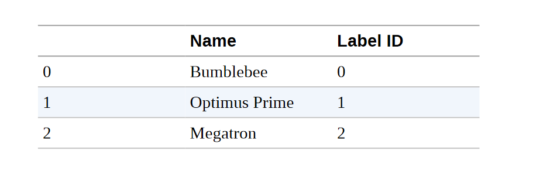


这种方法的问题在于它在名称之间创建了一个虚构的排序，而神经网络非常擅长学习这种关系。因此，我们可以为每个类别创建一个新列，并在类别为真时分配 1，否则分配 0。在 Pandas 中，这可以使用 get_dummies() 函数实现，如下所示：

```
pd.get_dummies(categorical_df["Name"])

```

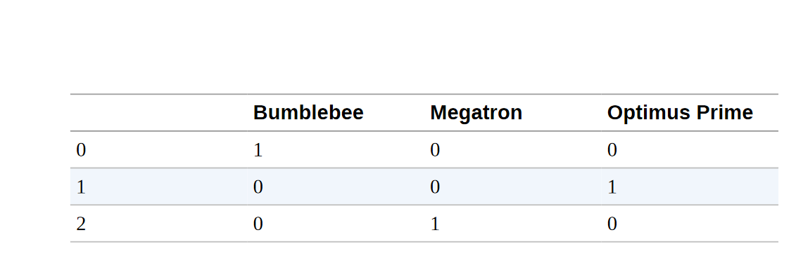

这个 DataFrame 的行是独热向量，只有一个“热”条目为 1，其他所有条目都为 0。现在，看看我们的 input_ids，我们遇到了类似的问题：元素创建了一个序数尺度。这意味着添加或减去两个 ID 是一个无意义的操作，因为结果是一个代表另一个随机词token的新 ID。

另一方面，添加两个独热编码的结果可以很容易地解释：两个“热”条目表示相应的词token同时出现。我们可以通过将 input_ids 转换为张量并应用 one_hot() 函数来在 PyTorch 中创建独热编码，如下所示：

```
import torch import torch.nn.functional as F 
input_ids = torch.tensor(input_ids) 
one_hot_encodings = F.one_hot(input_ids, num_classes=len(token2idx)) 


one_hot_encodings.shape 
torch.Size([38, 20])

```

对于 38 个输入词token中的每一个，我们现在都有一个 20 维的独热向量，因为我们的词汇表包含 20 个独特的字符。

在 one_hot() 函数中设置 num_classes 非常重要，因为否则独热向量可能最终会比词汇表的长度短（需要手动用零填充）。在 TensorFlow 中，等效函数是 tf.one_hot()，其中 depth 参数扮演 num_classes 的角色。

通过检查第一个向量，我们可以验证 1 是否出现在 input_ids[0] 指示的位置：

```
print(f"Token: {tokenized_text[0]}") 
print(f"Tensor index: {input_ids[0]}") 
print(f"One-hot: {one_hot_encodings[0]}") 

Token: T 
Tensor index: 5 
One-hot: tensor([0, 0, 0, 0, 0, 1, 0, 0, 0, 0, 0, 0, 0, 0, 0, 0, 0, 0, 0, 0])
```

从我们的简单示例中，我们可以看到字符级词tokenizer化忽略了文本中的任何结构，并将整个字符串视为字符流。虽然这有助于处理拼写错误和稀有词，但主要缺点是语言结构，例如单词，需要从数据中学习。这需要大量的计算、内存和数据。因此，字符词tokenizer化在实践中很少使用。相反，在词tokenizer化步骤中保留了一些文本结构。单词词tokenizer化是一种直接的方法，让我们看看它是如何工作的。


## 单词词tokenizer化

我们可以将文本拆分为单词并将每个单词映射到一个整数，而不是将文本拆分为字符。从一开始就使用单词使模型能够跳过从字符中学习单词的步骤，从而降低训练过程的复杂性。


一种简单的单词词tokenizer类使用空格来对文本进行词tokenizer化。我们可以通过将 Python 的 split() 函数直接应用于原始文本（就像我们测量推文长度时所做的那样）来做到这一点：


```
tokenized_text = text.split() 
print(tokenized_text) 

['Tokenizing', 'text', 'is', 'a', 'core', 'task', 'of', 'NLP.']

```

从这里我们可以采取与字符词tokenizer相同的步骤，将每个单词映射到一个 ID。但是，我们已经可以看到这种词tokenizer化方案的一个潜在问题：标点符号没有被考虑在内，因此 NLP. 被视为单个词token。鉴于单词可以包含变格、共轭或拼写错误，词汇表的大小很容易增长到数百万个！

一些单词词tokenizer有额外的标点符号规则。也可以应用词干提取或词形还原，将单词规范化为词干（例如，“great”、“greater”和“greatest”都变成“great”），但代价是丢失文本中的一些信息。


拥有大量词汇表是一个问题，因为它需要神经网络具有大量的参数。为了说明这一点，假设我们有 100 万个独特的单词，并希望在我们神经网络的第一层中将 100 万维输入向量压缩为 1000 维向量。这是大多数 NLP 架构中的标准步骤，这个第一层的权重矩阵将包含 100 万 × 1000 = 10 亿个权重。这已经与最大的 GPT-2 模型相当，后者总共有大约 15 亿个参数！


自然，我们希望避免在模型参数上如此浪费，因为模型训练成本高昂，而且更大的模型更难维护。一种常见的方法是限制词汇表并通过考虑语料库中最常见的 100,000 个单词来丢弃稀有词。不属于词汇表的单词被归类为“未知”，并映射到一个共享的 UNK 词token。这意味着我们在单词词tokenizer化过程中丢失了一些潜在的重要信息，因为模型没有关于与 UNK 相关的单词的信息。

如果在字符词tokenizer化和单词词tokenizer化之间存在一种折衷方案，既能保留所有输入信息，又能保留一些输入结构，那不是很好吗？有：子词词tokenizer化。


### 子词词tokenizer化

子词词tokenizer化的基本思想是结合字符词tokenizer化和单词词tokenizer化的最佳方面。一方面，我们希望将稀有词拆分为更小的单元，以允许模型处理复杂的单词和拼写错误。另一方面，我们希望将常用词保留为唯一实体，以便我们可以将输入长度保持在可管理的大小。子词词tokenizer化（以及单词词tokenizer化）的主要区别在于它是使用统计规则和算法从预训练语料库中学习的。

NLP 中常用的子词词tokenizer化算法有多种，但让我们从 BERT 和 DistilBERT 词tokenizer使用的 WordPiece 开始。理解 WordPiece 如何工作最简单的方法是看它实际运行。Transformers 提供了一个方便的 AutoTokenizer 类，允许您快速加载与预训练模型关联的词tokenizer——我们只需调用它的 from_pretrained() 方法，提供 Hub 上模型的 ID 或本地文件路径。让我们首先加载 DistilBERT 的词tokenizer：


```
from transformers import AutoTokenizer 
model_ckpt = "distilbert-base-uncased" 
tokenizer = AutoTokenizer.from_pretrained(model_ckpt)
```

AutoTokenizer 类属于一组更大的“auto”类，其工作是从检查点名称自动检索模型的配置、预训练权重或词汇表。这允许您在模型之间快速切换，但如果您希望手动加载特定类，也可以这样做。例如，我们可以按如下方式加载 DistilBERT 词tokenizer：

```
from transformers import DistilBertTokenizer 
distilbert_tokenizer = DistilBertTokenizer.from_pretrained(model_ckpt)


```

当您第一次运行 AutoTokenizer.from_pretrained() 方法时，您会看到一个进度条，显示从 Hugging Face Hub 加载了预训练词tokenizer的哪些参数。当您第二次运行代码时，它将从缓存中加载词tokenizer，通常位于 ~/.cache/huggingface。


让我们通过将我们的简单示例“Tokenizing text is a core task of NLP.” 文本提供给它来检查这个词tokenizer是如何工作的：

```
encoded_text = tokenizer(text) 
print(encoded_text) 

{'input_ids': [101, 19204, 6026, 3793, 2003, 1037, 4563, 4708, 1997, 17953, 2361, 1012, 102], 'attention_mask': [1, 1, 1, 1, 1, 1, 1, 1, 1, 1, 1, 1, 1]}

```

就像字符词tokenizer化一样，我们可以看到单词已被映射到 input_ids 字段中的唯一整数。我们将在下一节讨论 attention_mask 字段的作用。现在我们有了 input_ids，我们可以使用词tokenizer的 convert_ids_to_tokens() 方法将它们转换回词token：

```
tokens = tokenizer.convert_ids_to_tokens(encoded_text.input_ids) 
print(tokens) 

['[CLS]', 'token', '##izing', 'text', 'is', 'a', 'core', 'task', 'of', 'nl', '##p', '.', '[SEP]']

```

我们在这里可以观察到三件事。首先，一些特殊的 [CLS] 和 [SEP] 词token已添加到序列的开头和结尾。这些词token因模型而异，但它们的主要作用是指示序列的开始和结束。其次，每个词token都已小写，这是此特定检查点的功能。最后，我们可以看到“tokenizing”和“NLP”被拆分成了两个词token，这是有道理的，因为它们不是常用词。##izing 和 ##p 中的 ## 前缀表示前面的字符串不是空格；当您将词token转换回字符串时，任何带有此前缀的词token都应与前一个词token合并。AutoTokenizer 类有一个 convert_tokens_to_string() 方法可以做到这一点，所以让我们将它应用于我们的词token：

```
print(tokenizer.convert_tokens_to_string(tokens)) 

[CLS] tokenizing text is a core task of nlp. [SEP]

```

AutoTokenizer 类还具有几个提供有关词tokenizer信息的属性。例如，我们可以检查词汇表大小：

```
tokenizer.vocab_size 

30522

```

以及相应模型的最大上下文大小：

```
tokenizer.model_max_length 

512

```

另一个值得了解的有趣属性是模型在其正向传递中期望的字段的名称：

```
tokenizer.model_input_names 

['input_ids', 'attention_mask']
```

现在我们对单个字符串的词tokenizer化过程有了基本的了解，让我们看看如何对整个数据集进行词tokenizer化！


使用预训练模型时，一定要确保您使用的是与模型一起训练的词tokenizer。从模型的角度来看，切换词tokenizer就像打乱词汇表。如果周围的每个人都开始将“房子”等随机词换成“猫”，您也很难理解发生了什么！


## 词tokenizer化整个数据集

要对整个语料库进行词tokenizer化，我们将使用 DatasetDict 对象的 map() 方法。我们将在本书中多次遇到这个方法，因为它提供了一种将处理函数应用于数据集中每个元素的便捷方法。正如我们将很快看到的那样，map() 方法也可以用于创建新的行和列。

首先，我们需要一个处理函数来对我们的示例进行词tokenizer化：


```
def tokenize(batch): 
	return tokenizer(batch["text"], padding=True, truncation=True)

```

这个函数将词tokenizer应用于一批示例；padding=True 会将示例用零填充到批次中最长示例的大小，truncation=True 会将示例截断为模型的最大上下文大小。要查看 tokenize() 的实际效果，让我们传递来自训练集的两个示例：


```
print(tokenize(emotions["train"][:2]))
{'input_ids': [[101, 1045, 2134, 2102, 2514, 26608, 102, 0, 0, 0, 0, 0, 0, 0, 0, 0, 0, 0, 0, 0, 0, 0, 0], [101, 1045, 2064, 2175, 2013, 3110, 2061, 20625, 2000, 2061, 9636, 17772, 2074, 2013, 2108, 2105, 2619, 2040, 14977, 1998, 2003, 8300, 102]], 'attention_mask': [[1, 1, 1, 1, 1, 1, 1, 0, 0, 0, 0, 0, 0, 0, 0, 0, 0, 0, 0, 0, 0, 0, 0], [1, 1, 1, 1, 1, 1, 1, 1, 1, 1, 1, 1, 1, 1, 1, 1, 1, 1, 1, 1
,,,,],[,,,,,,,,,,,,,,,,,,,, 1, 1, 1]]}

```

在这里，我们可以看到填充的结果：input_ids 的第一个元素比第二个元素短，因此已将零添加到该元素以使它们的长度相同。这些零在词汇表中有一个对应的 [PAD] 词token，我们之前遇到的特殊词token集也包括 [CLS] 和 [SEP] 词token：

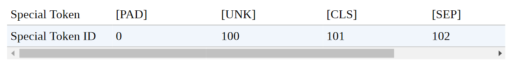

还要注意，除了将编码的推文作为 input_ids 返回之外，词tokenizer 还返回一个 attention_mask 数组列表。这是因为我们不希望模型被额外的填充词token弄糊涂：注意力掩码允许模型忽略输入中填充的部分。图 2-3 直观地解释了如何填充输入 ID 和注意力掩码。

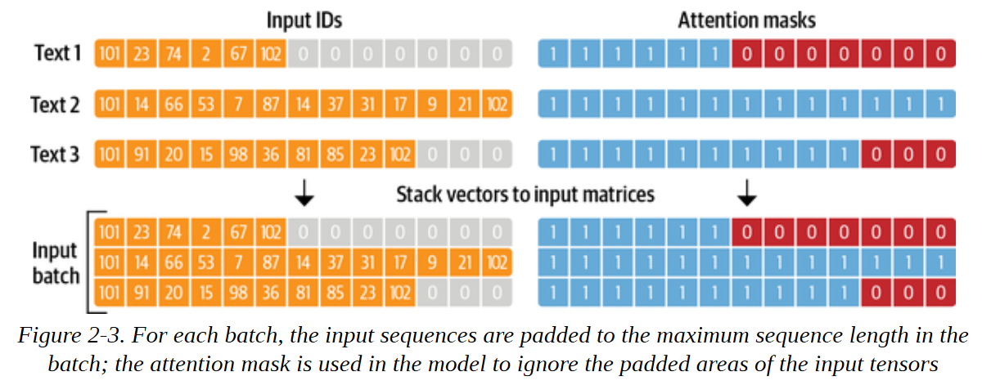

定义了处理函数后，我们就可以用一行代码将其应用于语料库中的所有拆分：

```
emotions_encoded = emotions.map(tokenize, batched=True, batch_size=None)

```

默认情况下，map() 方法对语料库中的每个示例单独进行操作，因此设置 batched=True 将在批次中对推文进行编码。因为我们设置了 batch_size=None，所以我们的 tokenize() 函数将作为一个批次应用于整个数据集。这确保了输入张量和注意力掩码在全局具有相同的形状，我们可以看到此操作已将新的 input_ids 和 attention_mask 列添加到数据集中：

```
print(emotions_encoded["train"].column_names) 

['attention_mask', 'input_ids', 'label', 'text']

```

在后面的章节中，我们将看到如何使用数据整理器动态填充每个批次中的张量。全局填充将在下一节中派上用场，我们将在其中从整个语料库中提取特征矩阵。


## 训练文本分类器

正如第 1 章中所讨论的，DistilBERT 等模型经过预训练，可以预测文本序列中掩码的单词。但是，我们不能将这些语言模型直接用于文本分类；我们需要稍微修改它们。为了了解需要进行哪些修改，让我们看一下 DistilBERT 等基于编码器的模型的架构，如图 2-4 所示。

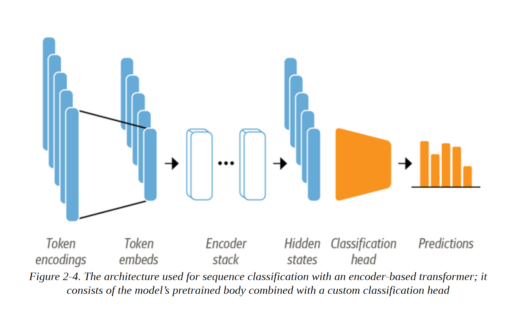

&emsp;&emsp;首先，文本被词tokenizer化并表示为称为词token编码的独热向量。词tokenizer词汇表的大小决定了词token编码的维数，它通常包含 20k-200k 个独特的词token。接下来，这些词token编码被转换为词token嵌入，它们是存在于低维空间中的向量。然后，词token嵌入通过编码器块层，为每个输入词token生成一个隐藏状态。对于语言建模的预训练目标，每个隐藏状态都被馈送到一个预测掩码输入词token的层。对于分类任务，我们将语言建模层替换为分类层。


&emsp;&emsp;在实践中，PyTorch 省略了为词token编码创建独热向量的步骤，因为将矩阵与独热向量相乘与从矩阵中选择一列相同。这可以通过直接从矩阵中获取具有词token ID 的列来完成。我们将在第 3 章中使用 nn.Embedding 类时看到这一点。

我们有两个选项来在 Twitter 数据集上训练这样的模型：

- 特征提取
  
我们使用隐藏状态作为特征，并仅训练一个分类器，而不修改预训练模型。

- 微调

我们端到端地训练整个模型，这也更新了预训练模型的参数。


在以下部分中，我们将探讨 DistilBERT 的两个选项并检查它们的权衡。


### Transformer 作为特征提取器

&emsp;&emsp;将 Transformer 用作特征提取器相当简单。如图 2-5 所示，我们在训练期间冻结主体的权重，并使用隐藏状态作为分类器的特征。这种方法的优点是我们可以快速训练一个小型或浅层模型。这样的模型可以是神经分类层，也可以是不依赖梯度的方法，例如随机森林。如果 GPU 不可用，这种方法特别方便，因为隐藏状态只需要预先计算一次。

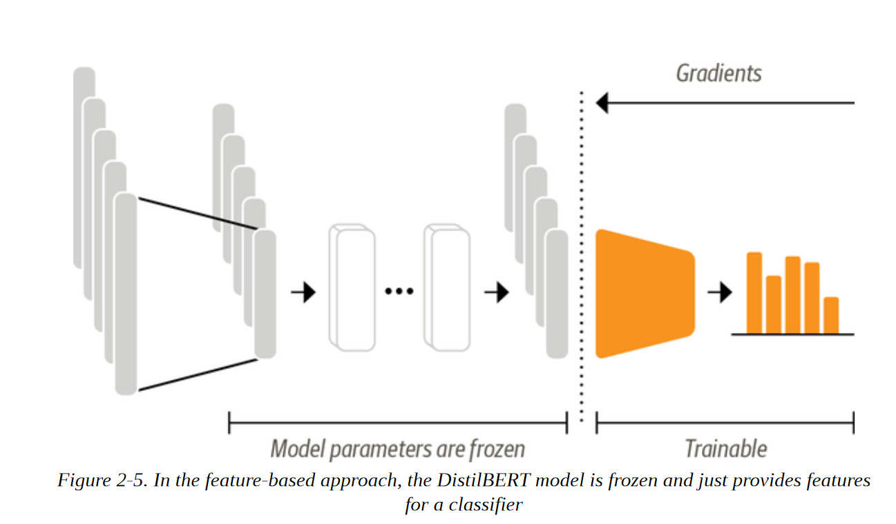

#### 使用预训练模型

&emsp;&emsp;我们将使用 Transformers 中另一个方便的自动类，称为 AutoModel。与 AutoTokenizer 类类似，AutoModel 有一个 from_pretrained() 方法来加载预训练模型的权重。让我们使用此方法加载 DistilBERT 检查点：

```
from transformers import AutoModel 
model_ckpt = "distilbert-base-uncased" 
device = torch.device("cuda" if torch.cuda.is_available() else "cpu") 
model = AutoModel.from_pretrained(model_ckpt).to(device)

```

在这里，我们使用 PyTorch 来检查 GPU 是否可用，然后将 PyTorch nn.Module.to() 方法链接到模型加载器。这确保了如果我们有 GPU，模型将在 GPU 上运行。如果没有，模型将在 CPU 上运行，这可能会慢得多。

AutoModel 类将词token编码转换为嵌入，然后将它们通过编码器堆栈以返回隐藏状态。让我们看看如何从语料库中提取这些状态。


&emsp;&emsp;尽管本书中的代码主要用 PyTorch 编写，但 Transformers 提供了与 TensorFlow 和 JAX 的紧密互操作性。这意味着您只需要更改几行代码就可以在您最喜欢的深度学习框架中加载预训练模型！例如，我们可以使用 TensorFlow 中的 TFAutoModel 类加载 DistilBERT，如下所示：

```
from transformers import TFAutoModel 
tf_model = TFAutoModel.from_pretrained(model_ckpt)

```

当模型仅在一个框架中发布，但您想在另一个框架中使用它时，这种互操作性特别有用。例如，我们将在第 4 章中遇到的 XLM-RoBERTa 模型只有 PyTorch 权重，因此如果您尝试像以前一样在 TensorFlow 中加载它：

```
tf_xlmr = TFAutoModel.from_pretrained("xlm-roberta-base")

```

您会收到一个错误。在这些情况下，您可以为 TfAutoModel.from_pretrained() 函数指定一个 from_pt=True 参数，库会自动为您下载并转换 PyTorch 权重：

```
tf_xlmr = TFAutoModel.from_pretrained("xlm-roberta-base", from_pt=True)

```

如您所见，在 Transformers 中切换框架非常简单！在大多数情况下，您只需在类名前添加“TF”前缀，即可获得等效的 TensorFlow 2.0 类。当我们使用“pt”字符串（例如，在下一节中）时，它是 PyTorch 的缩写，只需将其替换为“tf”，它是 TensorFlow 的缩写。

#### 提取最后一层隐藏状态

&emsp;&emsp;为了热身，让我们检索单个字符串的最后一个隐藏状态。我们需要做的第一件事是编码字符串并将词token转换为 PyTorch 张量。这可以通过向词tokenizer提供 return_tensors="pt" 参数来完成，如下所示：

```
text = "this is a test" 
inputs = tokenizer(text, return_tensors="pt") 
print(f"Input tensor shape: {inputs['input_ids'].size()}") 

Input tensor shape: torch.Size([1, 6])

```

&emsp;&emsp;如我们所见，生成的张量具有形状 [batch_size, n_tokens]。现在我们已经将编码作为张量，最后一步是将它们放置在与模型相同的设备上并传递输入，如下所示：

```
inputs = {k:v.to(device) 
for k,v in inputs.items()} 
with torch.no_grad(): 
	outputs = model(**inputs) 

print(outputs) 

BaseModelOutput(last_hidden_state=tensor([[[-0.1565, -0.1862, 0.0528, ..., -0.1188, 0.0662, 0.5470], [-0.3575, -0.6484, -0.0618, ..., -0.3040, 0.3508, 0.5221], [-0.2772, -0.4459, 0.1818, ..., -0.0948, -0.0076, 0.9958], [-0.2841, -0.3917, 0.3753, ..., -0.2151, -0.1173, 1.0526], [ 0.2661, -0.5094, -0.3180, ..., -0.4203, 0.0144, -0.2149], [ 0.9441, 0.0112, -0.4714, ..., 0.1439, -0.7288, -0.1619]]], device='cuda:0'), hidden_states=None, attentions=None)

```

&emsp;&emsp;在这里，我们使用了 torch.no_grad() 上下文管理器来禁用梯度的自动计算。这对于推理很有用，因为它减少了计算的内存占用。根据模型配置，输出可以包含多个对象，例如隐藏状态、损失或注意力，排列在一个类似于 Python 中的 namedtuple 的类中。在我们的示例中，模型输出是 BaseModelOutput 的实例，我们可以通过名称简单地访问其属性。当前模型只返回一个属性，即最后一个隐藏状态，因此让我们检查它的形状：

```
outputs.last_hidden_state.size() 
torch.Size([1, 6, 768])

```

&emsp;&emsp;查看隐藏状态张量，我们看到它具有形状 [batch_size, n_tokens, hidden_dim]。换句话说，为 6 个输入词token中的每一个返回一个 768 维向量。对于分类任务，通常的做法是仅使用与 [CLS] 词token 关联的隐藏状态作为输入特征。由于此词token出现在每个序列的开头，我们可以通过简单地索引到 outputs.last_hidden_state 中来提取它，如下所示：

```
outputs.last_hidden_state[:,0].size() 

torch.Size([1, 768])

```

&emsp;&emsp;现在我们知道如何获取单个字符串的最后一个隐藏状态；让我们通过创建一个存储所有这些向量的新 hidden_state 列，对整个数据集执行相同的操作。就像我们对词tokenizer所做的那样，我们将使用 DatasetDict 的 map() 方法一次性提取所有隐藏状态。我们需要做的第一件事是将前面的步骤包装在一个处理函数中：

```
def extract_hidden_states(batch): # Place model inputs on the GPU 
	inputs = {
	k:v.to(device) for k,v in batch.items() if k in tokenizer.model_input_names
	} # Extract last hidden states 
	with torch.no_grad(): 
		last_hidden_state = model(**inputs).last_hidden_state # Return vector for [CLS] token 
	return {"hidden_state": last_hidden_state[:,0].cpu().numpy()}

```

&emsp;&emsp;这个函数和我们之前的逻辑之间的唯一区别是最后一步，我们将最终隐藏状态放回 CPU 上作为一个 NumPy 数组。当我们使用批处理输入时，map() 方法要求处理函数返回 Python 或 NumPy 对象。

由于我们的模型期望张量作为输入，接下来要做的是将 input_ids 和 attention_mask 列转换为“torch”格式，如下所示：

```
emotions_encoded.set_format("torch", columns=["input_ids", "attention_mask", "label"])
```

然后我们可以继续一次性提取所有拆分中的隐藏状态：

```
emotions_hidden = emotions_encoded.map(extract_hidden_states, batched=True)

```

请注意，在这种情况下，我们没有设置 batch_size=None，这意味着使用默认的 batch_size=1000。正如预期的那样，应用 extract_hidden_states() 函数为我们的数据集添加了一个新的 hidden_state 列：

```
emotions_hidden["train"].column_names 

['attention_mask', 'hidden_state', 'input_ids', 'label', 'text']

```

现在我们有了与每条推文相关的隐藏状态，下一步就是训练一个分类器。为此，我们需要一个特征矩阵——让我们来看看。


#### 创建特征矩阵

&emsp;&emsp;预处理后的数据集现在包含了我们在其上训练分类器所需的所有信息。我们将使用隐藏状态作为输入特征，将标签作为目标。我们可以使用众所周知的 Scikit-learn 格式轻松创建相应的数组，如下所示：

```
import numpy as np 
X_train = np.array(emotions_hidden["train"]["hidden_state"]) 
X_valid = np.array(emotions_hidden["validation"]["hidden_state"]) 
y_train = np.array(emotions_hidden["train"]["label"]
y_valid = np.array(emotions_hidden["validation"]["label"]) 


X_train.shape, X_valid.shape ((16000, 768), (2000, 768))

```

&emsp;&emsp;在我们根据隐藏状态训练模型之前，最好进行快速检查以确保它们提供了我们要分类的情绪的有用表示。在下一节中，我们将看到可视化特征如何提供一种快速实现此目的的方法。


#### 可视化训练集

&emsp;&emsp;由于在 768 维中可视化隐藏状态至少可以说很棘手，我们将使用强大的 UMAP 算法将向量投影到二维。UMAP 在特征缩放到 [0,1] 区间时效果最佳，因此我们将首先应用 MinMaxScaler，然后使用 umap-learn 库中的 UMAP 实现来减少隐藏状态：

```
from umap import UMAP 
from sklearn.preprocessing import MinMaxScaler # Scale features to [0,1] range 
X_scaled = MinMaxScaler().fit_transform(X_train)
# Initialize and fit UMAP 
mapper = UMAP(n_components=2, metric="cosine").fit(X_scaled) 
# Create a DataFrame of 2D embeddings 
df_emb = pd.DataFrame(mapper.embedding_, columns=["X", "Y"]) 
df_emb["label"] = y_train 
df_emb.head()

```

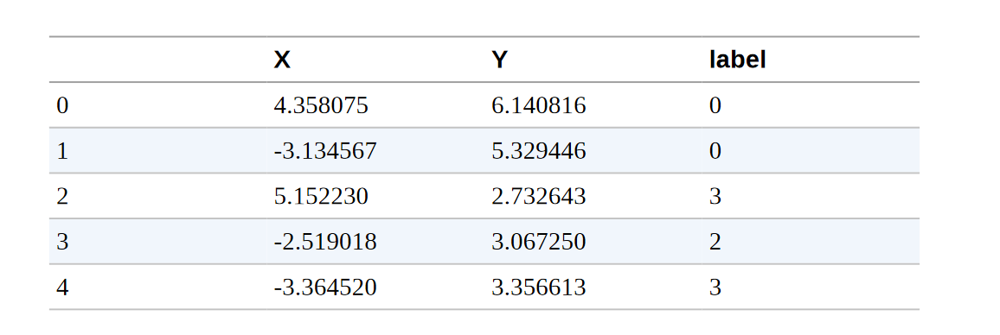


&emsp;&emsp;结果是一个数组，它具有相同数量的训练样本，但只有 2 个特征，而不是我们开始的 768 个！让我们进一步研究压缩数据，并分别绘制每个类别的点密度：

```
fig, axes = plt.subplots(2, 3, figsize=(7,5)) 
axes = axes.flatten() 
cmaps = ["Greys", "Blues", "Oranges", "Reds", "Purples", "Greens"] 
labels = emotions["train"].features["label"].names 
for i, (label, cmap) in enumerate(zip(labels, cmaps)): 
	df_emb_sub = df_emb.query(f"label == {i}") 
	axes[i].hexbin(df_emb_sub["X"], df_emb_sub["Y"], cmap=cmap, gridsize=20, linewidths=(0,)) 
	axes[i].set_title(label) 		
    axes[i].set_xticks([]), axes[i].set_yticks([]) 
plt.tight_layout() 
plt.show()

```

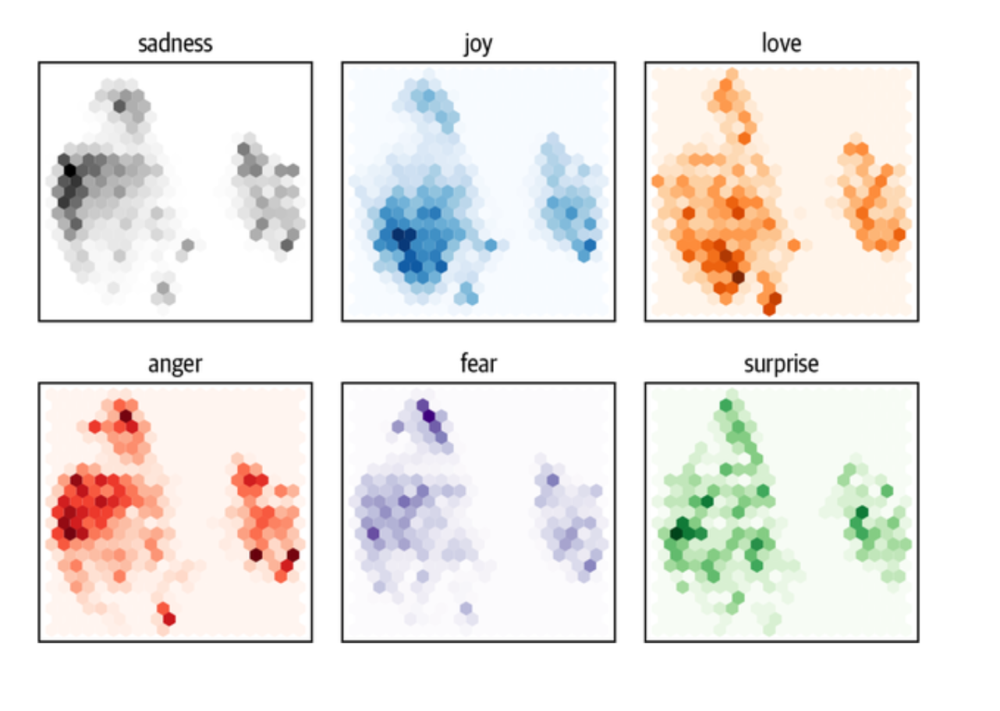


&emsp;&emsp;这些只是投影到低维空间。仅仅因为某些类别重叠并不意味着它们在原始空间中不可分离。相反，如果它们在投影空间中可分离，那么它们在原始空间中也将是可分离的。

&emsp;&emsp;从这张图中，我们可以看到一些明显的模式：悲伤、愤怒和恐惧等负面情绪都占据着相似的区域，分布略有不同。另一方面，喜悦和爱与负面情绪很好地分离，并且也共享相似的空间。最后，惊讶分散在各处。虽然我们可能希望有一些分离，但这绝不能保证，因为模型没有经过训练来区分这些情绪。它只是通过猜测文本中的掩码词来隐式地学习它们。

现在我们已经对数据集的特征有了一些了解，让我们最终训练一个模型！


#### 训练一个简单的分类器

&emsp;&emsp;我们已经看到，隐藏状态在情绪之间有所不同，尽管对于其中一些情绪来说，没有明显的界限。让我们使用这些隐藏状态来训练 Scikit-learn 的逻辑回归模型。训练这样一个简单的模型速度很快，不需要 GPU：

```
from sklearn.linear_model import LogisticRegression 
# We increase `max_iter` to guarantee convergence 
lr_clf = LogisticRegression(max_iter=3000) 
lr_clf.fit(X_train, y_train) 
lr_clf.score(X_valid, y_valid) 

0.633

```

&emsp;&emsp;查看准确率，我们的模型似乎只比随机好一点——但由于我们正在处理一个不平衡的多类数据集，它实际上要好得多。我们可以通过将我们的模型与一个简单的基线进行比较来检验它是否足够好。在 Scikit-learn 中，有一个 DummyClassifier 可以用来构建一个分类器，它使用简单的启发式方法，例如总是选择多数类或总是随机抽取一个类。在这种情况下，性能最佳的启发式方法是始终选择最常见的类，这会产生大约 35% 的准确率：

```
from sklearn.dummy import DummyClassifier 
dummy_clf = DummyClassifier(strategy="most_frequent") 
dummy_clf.fit(X_train, y_train) 
dummy_clf.score(X_valid, y_valid) 


0.352

```

&emsp;&emsp;因此，我们使用 DistilBERT 嵌入的简单分类器明显优于我们的基线。我们可以通过查看分类器的混淆矩阵来进一步研究模型的性能，混淆矩阵告诉我们真实标签和预测标签之间的关系：


```
from sklearn.metrics import ConfusionMatrixDisplay, confusion_matrix 
def plot_confusion_matrix(y_preds, y_true, labels): 
	cm = confusion_matrix(y_true, y_preds, normalize="true") fig, ax = plt.subplots(figsize=(6, 6)) 
	disp = ConfusionMatrixDisplay(confusion_matrix=cm, display_labels=labels) 
	disp.plot(cmap="Blues", values_format=".2f", ax=ax, colorbar=False) 
	plt.title("Normalized confusion matrix") 
	plt.show() 
y_preds = lr_clf.predict(X_valid) 
plot_confusion_matrix(y_preds, y_valid, labels)

```

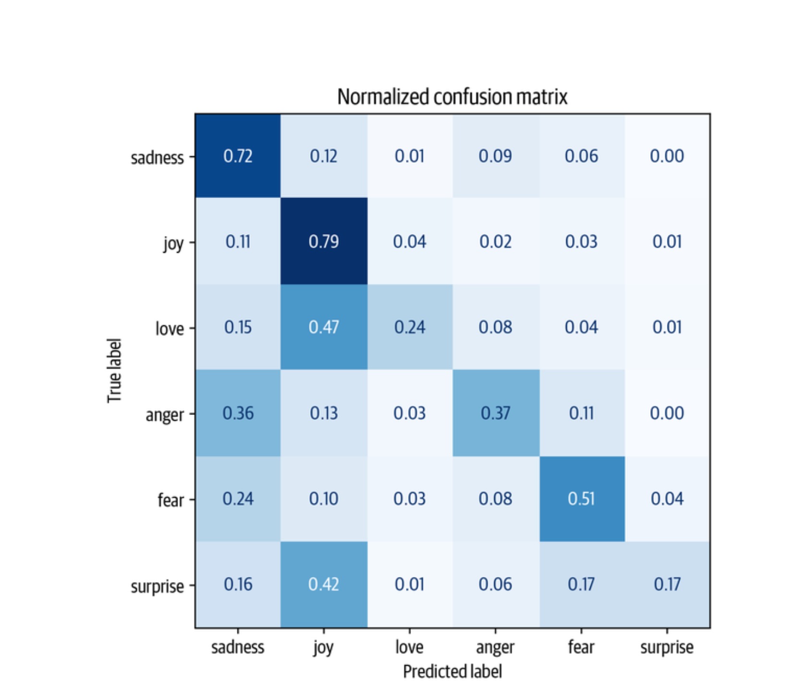


&emsp;&emsp;我们可以看到，愤怒和恐惧最常与悲伤混淆，这与我们在可视化嵌入时所做的观察一致。此外，爱和惊讶经常被误认为是喜悦。

&emsp;&emsp;在下一节中，我们将探讨微调方法，它可以带来更好的分类性能。然而，重要的是要注意，这样做需要更多的计算资源，例如 GPU，这在您的组织中可能不可用。在这些情况下，基于特征的方法可以成为传统机器学习和深度学习之间的一个很好的折衷方案。


### 微调 Transformer

&emsp;&emsp;现在让我们探索端到端微调 Transformer 需要什么。使用微调方法，我们不将隐藏状态用作固定特征，而是训练它们，如图 2-6 所示。这需要分类头是可微的，这就是为什么这种方法通常使用神经网络进行分类的原因。

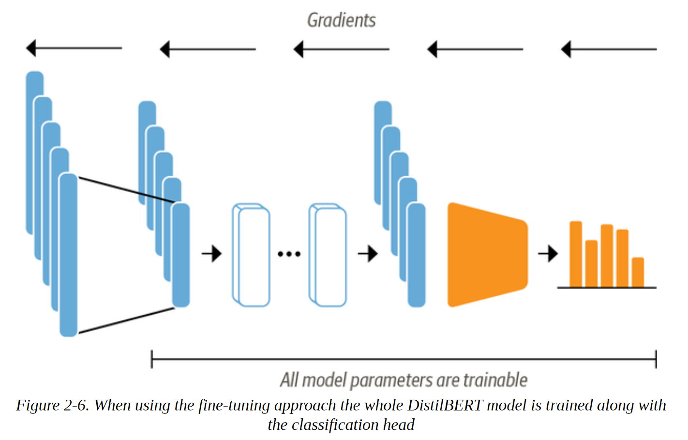

训练作为分类模型输入的隐藏状态将帮助我们避免使用可能不适合分类任务的数据的问题。相反，初始隐藏状态在训练过程中会进行调整，以降低模型损失，从而提高其性能。


我们将使用 Transformers 中的 Trainer API 来简化训练循环。让我们看看设置一个 Trainer 需要哪些要素！

####  加载预训练模型

我们需要做的第一件事是加载一个预训练的 DistilBERT 模型，就像我们在基于特征的方法中使用的一样。唯一的细微修改是我们使用 AutoModelForSequenceClassification 模型而不是 AutoModel。区别在于 AutoModelForSequenceClassification 模型在预训练模型输出的顶部有一个分类头，可以与基础模型一起轻松训练。我们只需要指定模型必须预测多少个标签（在我们的例子中是六个），因为这决定了分类头的输出数量：

```
from transformers import AutoModelForSequenceClassification 
num_labels = 6 
model = (AutoModelForSequenceClassification .from_pretrained(model_ckpt, num_labels=num_labels) .to(device))

```

您会看到一条警告，提示模型的某些部分是随机初始化的。这是正常的，因为分类头尚未经过训练。下一步是定义将在微调过程中用于评估模型性能的指标。

#### 定义性能指标

为了在训练过程中监控指标，我们需要为 Trainer 定义一个 compute_metrics() 函数。该函数接收一个 EvalPrediction 对象（它是一个带有 predictions 和 label_ids 属性的命名元组），并需要返回一个将每个指标的名称映射到其值的字典。对于我们的应用程序，我们将计算模型的 F1 分数和准确率，如下所示：

```
from sklearn.metrics import accuracy_score, f1_score 
def compute_metrics(pred): 
	labels = pred.label_ids 
	preds = pred.predictions.argmax(-1) 
	f1 = f1_score(labels, preds, average="weighted")
	acc = accuracy_score(labels, preds) 
	return {"accuracy": acc, "f1": f1}

```

准备好数据集和指标后，在定义 Trainer 类之前，我们只需要处理最后两件事：

1. 登录我们在 Hugging Face Hub 上的帐户。这将允许我们将微调后的模型推送到我们在 Hub 上的帐户并与社区分享。
2. 定义训练运行的所有超参数。


我们将在下一节中解决这些步骤。


#### 训练模型

如果您在 Jupyter 笔记本中运行此代码，您可以使用以下辅助函数登录 Hub：


```
from huggingface_hub import notebook_login
notebook_login()

```

这将显示一个小部件，你可以在其中输入你的用户名和密码，或一个具有写入权限的访问令牌。 你可以在Hub文档中找到关于如何创建访问令牌的细节。 如果你在终端工作，你可以通过运行以下命令登录：

```
$ huggingface-cli login

```


为了定义训练参数，我们使用 TrainingArguments 类。这个类存储了大量信息，可以让您对训练和评估进行细粒度控制。要指定的最重要的参数是 output_dir，它是存储所有训练工件的地方。以下是 TrainingArguments 的一个示例：


```
from transformers import Trainer, TrainingArguments
batch_size = 64 
logging_steps = len(emotions_encoded["train"]) // batch_size 
model_name = f"{model_ckpt}-finetuned-emotion" 
training_args = TrainingArguments(output_dir=model_name, num_train_epochs=2, learning_rate=2e-5, 	 per_device_train_batch_size=batch_size, per_device_eval_batch_size=batch_size, weight_decay=0.01, evaluation_strategy="epoch", disable_tqdm=False, logging_steps=logging_steps, push_to_hub=True, log_level="error")

```

在这里，我们还设置了批处理大小、学习率和 epoch 数，并指定在训练运行结束时加载最佳模型。有了这个最终要素，我们可以使用 Trainer 实例化和微调我们的模型：

```
from transformers import Trainer 
trainer = Trainer(model=model, args=training_args, compute_metrics=compute_metrics, train_dataset=emotions_encoded["train"], eval_dataset=emotions_encoded["validation"], tokenizer=tokenizer) 
trainer.train();
```

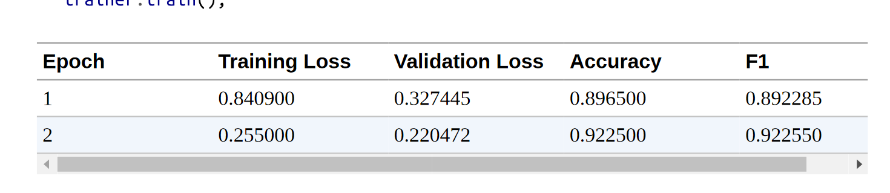

查看日志，我们可以看到我们的模型在验证集上的 F1 分数约为 92%——这比基于特征的方法有了显着提高！

我们可以通过计算混淆矩阵来更详细地查看训练指标。为了可视化混淆矩阵，我们首先需要获得验证集上的预测。Trainer 类的 predict() 方法返回几个可用于评估的有用对象：


```
preds_output = trainer.predict(emotions_encoded["validation"] )
```

predict()方法的输出是一个PredictionOutput对象，它包含预测和标签_ids的数组，以及我们传递给训练器的指标。 例如，验证集的指标可按以下方式访问:

```
preds_output.metrics 

{'test_loss': 0.22047173976898193, 'test_accuracy': 0.9225, 'test_f1': 0.9225500751072866, 'test_runtime': 1.6357, 'test_samples_per_second': 1222.725, 'test_steps_per_second': 19.564}

```

它还包含每个类别的原始预测。我们可以使用 np.argmax() 贪婪地解码预测。这会产生预测标签，其格式与基于特征的方法中 Scikit-learn 模型返回的标签相同：

```
y_preds = np.argmax(preds_output.predictions, axis=1)

```

有了预测，我们可以再次绘制混淆矩阵：

```
plot_confusion_matrix(y_preds, y_valid, labels)
```

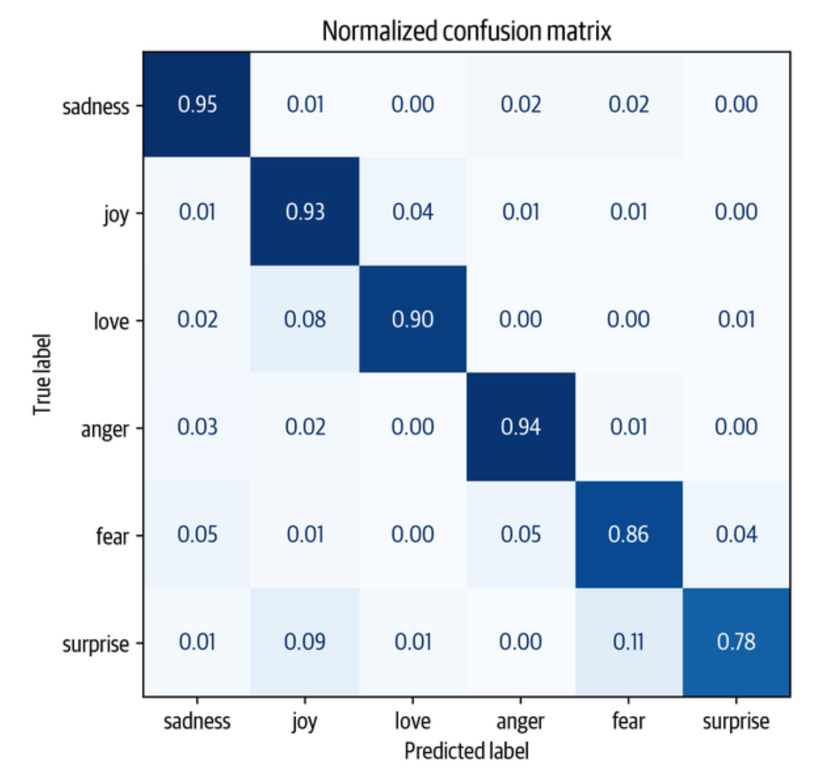

这更接近理想的对角线混淆矩阵。love 类别仍然经常与 joy 混淆，这似乎很自然。surprise 也经常被误认为是 joy，或者与 fear 混淆。总体而言，模型的性能似乎相当不错，但在我们结束之前，让我们更深入地研究一下我们的模型可能出现的错误类型。

**用Keras进行微调**

如果您使用的是 TensorFlow，也可以使用 Keras API 微调您的模型。与 PyTorch API 的主要区别在于没有 Trainer 类，因为 Keras 模型已经提供了一个内置的 fit() 方法。为了了解这是如何工作的，让我们首先将 DistilBERT 作为 TensorFlow 模型加载：

```
from transformers import TFAutoModelForSequenceClassification 
tf_model = (TFAutoModelForSequenceClassification .from_pretrained(model_ckpt, num_labels=num_labels))

```

接下来，我们将数据集转换为 tf.data.Dataset 格式。因为我们已经填充了词tokenizer化的输入，我们可以通过将 to_tf_dataset() 方法应用于 emotions_encoded 来轻松完成此转换：

```
# The column names to convert to TensorFlow tensors 
tokenizer_columns = tokenizer.model_input_names 
tf_train_dataset = emotions_encoded["train"].to_tf_dataset( columns=tokenizer_columns, label_cols=["label"], shuffle=True, batch_size=batch_size) 
tf_eval_dataset = emotions_encoded["validation"].to_tf_dataset( columns=tokenizer_columns, label_cols=["label"], shuffle=False, batch_size=batch_size)

```

在这里，我们还对训练集进行了 shuffle，并为训练集和验证集定义了批处理大小。最后要做的是编译和训练模型：

```
import tensorflow as tf 
tf_model.compile( optimizer=tf.keras.optimizers.Adam(learning_rate=5e-5), loss=tf.keras.losses.SparseCategoricalCrossentropy(from_logits=True), metrics=tf.metrics.SparseCategoricalAccuracy())
tf_model.fit(tf_train_dataset, validation_data=tf_eval_dataset, epochs=2)

```

#### 错误分析

在继续之前，我们应该进一步研究一下模型的预测。一个简单但功能强大的技术是按模型损失对验证样本进行排序。当我们在正向传递过程中传递标签时，会自动计算并返回损失。这是一个返回损失和预测标签的函数：

```
from torch.nn.functional import cross_entropy 
def forward_pass_with_label(batch): # Place all input tensors on the same device as the model 
inputs = {k:v.to(device) for k,v in batch.items() if k in tokenizer.model_input_names} 
with torch.no_grad(): output = model(**inputs) 
	pred_label = torch.argmax(output.logits, axis=-1) 
	loss = cross_entropy(output.logits, batch["label"].to(device), reduction="none") 
	# Place outputs on CPU for compatibility with other dataset columns 
	return {"loss": loss.cpu().numpy(), "predicted_label": pred_label.cpu().numpy()}

```


再次使用 map() 方法，我们可以应用此函数来获取所有样本的损失：

```
# Convert our dataset back to PyTorch tensors 
emotions_encoded.set_format("torch", columns=["input_ids", "attention_mask", "label"]) # Compute loss values 
emotions_encoded["validation"] = emotions_encoded["validation"].map( forward_pass_with_label, batched=True, batch_size=16)
```

最后，我们创建一个包含文本、损失和预测/真实标签的 DataFrame：

```
emotions_encoded.set_format("pandas") 
cols = ["text", "label", "predicted_label", "loss"] 
df_test = emotions_encoded["validation"][:][cols] df_test["label"] = df_test["label"].apply(label_int2str) df_test["predicted_label"] = (df_test["predicted_label"] .apply(label_int2str))

```

现在我们可以轻松地按升序或降序对 emotions_encoded 按损失进行排序。这个练习的目标是检测以下情况之一：

每个为数据添加标签的过程都可能存在缺陷。标注员可能会犯错误或意见不一致，而从其他特征推断出的标签可能是错误的。如果自动标注数据很容易，那么我们就不需要模型来做这件事。因此，存在一些错误标记的示例是正常的。使用这种方法，我们可以快速找到并纠正它们。

现实世界中的数据集总是有点混乱。使用文本时，输入中的特殊字符或字符串可能会对模型的预测产生很大影响。检查模型最弱的预测可以帮助识别这些特征，清理数据或注入类似的示例可以使模型更健壮。

让我们首先看一下损失最高的数据样本：

```
df_test.sort_values("loss", ascending=False).head(10)

```

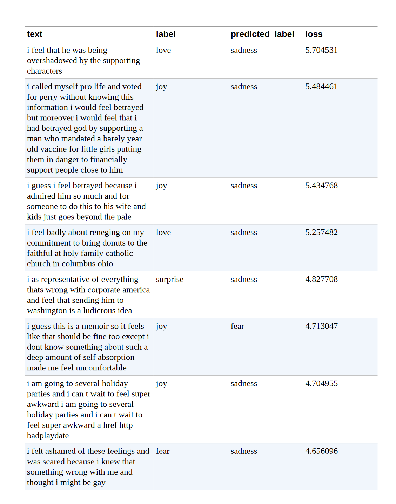

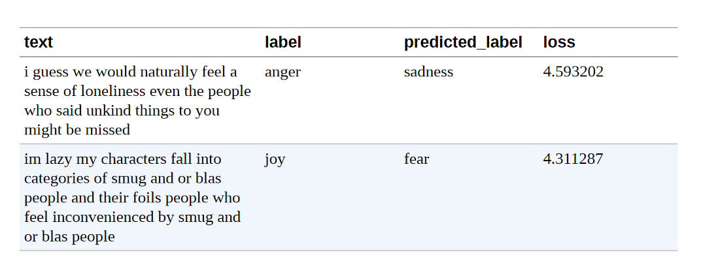


我们可以清楚地看到模型错误地预测了一些标签。另一方面，似乎有很多例子没有明确的类别，这可能是错误标记的，或者需要一个全新的类别。特别是，joy 似乎被多次错误标记。有了这些信息，我们可以改进数据集，这通常可以带来与拥有更多数据或更大模型一样大的性能提升（甚至更多）！

在查看损失最低的样本时，我们观察到模型在预测 sadness 类别时似乎最自信。深度学习模型非常擅长寻找和利用捷径来进行预测。因此，也值得花时间查看模型最自信的示例，这样我们就可以确信模型没有不适当地利用文本的某些特征。因此，让我们也看看损失最小的预测：

```
df_test.sort_values("loss", ascending=True).head(10)

```

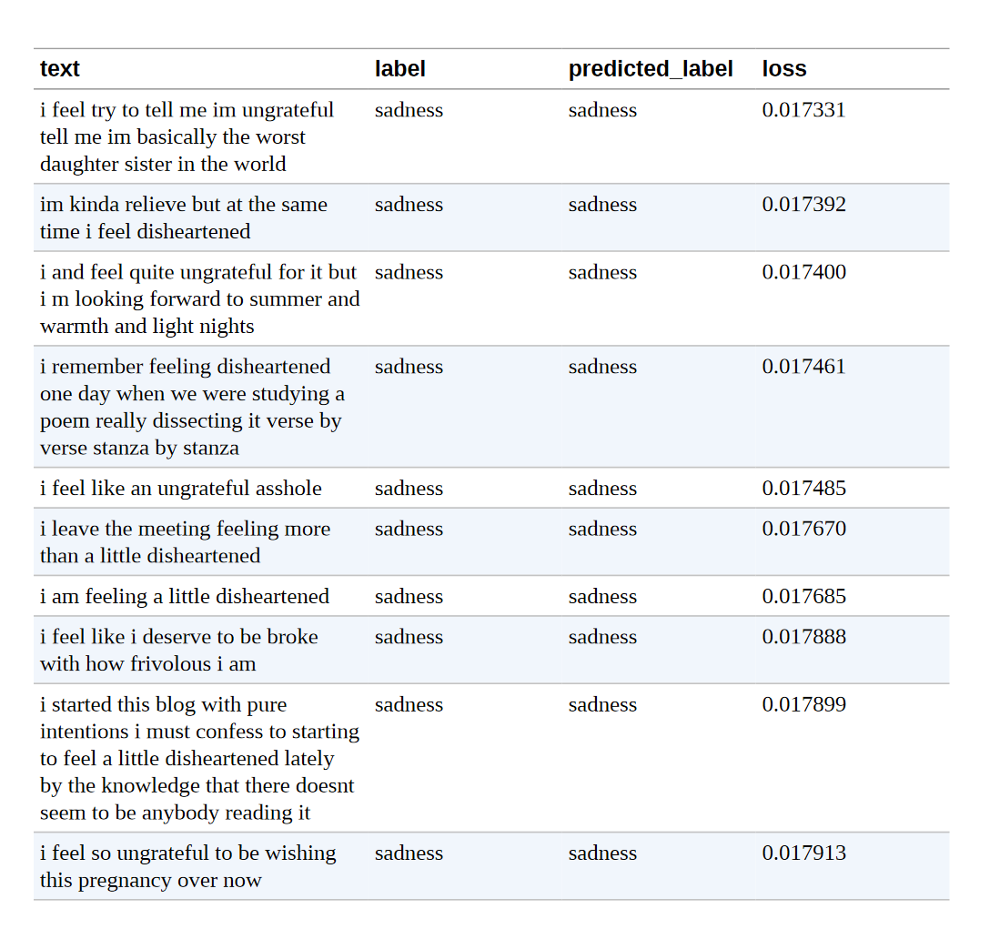


我们现在知道 joy 有时会被错误标记，并且模型对预测 sadness 标签最自信。有了这些信息，我们可以对数据集进行有针对性的改进，并密切关注模型似乎非常自信的类别。

在提供训练好的模型之前，最后一步是保存它以供以后使用。Transformers 允许我们通过几个步骤来做到这一点，我们将在下一节中向您展示。

#### 保存和共享模型

NLP 社区从共享预训练和微调模型中获益匪浅，每个人都可以通过 Hugging Face Hub 与他人分享他们的模型。任何社区生成的模型都可以像我们下载 DistilBERT 模型一样从 Hub 下载。使用 Trainer API，保存和共享模型很简单：

```
trainer.push_to_hub(commit_message="Training completed!")

```

我们还可以使用微调模型对新推文进行预测。由于我们将模型推送到 Hub，我们现在可以像第 1 章中那样使用 pipeline() 函数来使用它。首先，让我们加载管道：

```
from transformers import pipeline 
# Change `transformersbook` to your Hub username 
model_id = "transformersbook/distilbert-base-uncased-finetuned-emotion" classifier = pipeline("text-classification", model=model_id)
```

然后让我们用一个示例推文测试管道：

```
custom_tweet = "I saw a movie today and it was really good." 
preds = classifier(custom_tweet, return_all_scores=True)

```

最后，我们可以在条形图中绘制每个类别的概率。显然，模型估计最可能的类别是 joy，这对于给定的推文来说似乎是合理的：

```
preds_df = pd.DataFrame(preds[0]) 
plt.bar(labels, 100 * preds_df["score"], color='C0') 
plt.title(f'"{custom_tweet}"') 
plt.ylabel("Class probability (%)") 
plt.show()

```

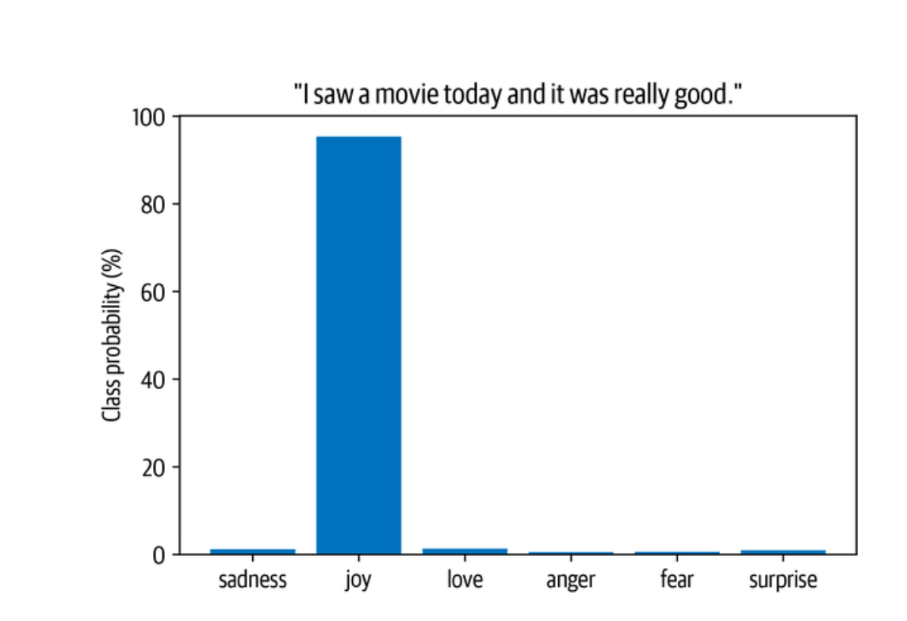


## 结论
恭喜，您现在知道如何训练 Transformer 模型来对推文中的情绪进行分类！我们已经看到了基于特征和微调的两种互补方法，并研究了它们的优缺点。

然而，这只是使用 Transformer 模型构建现实世界应用程序的第一步，我们还有很多工作要做。以下是您在 NLP 旅程中可能会遇到的挑战清单：

**我的老板希望我的模型昨天就投入生产！**

在大多数应用程序中，您的模型不会只是放在某个地方收集灰尘——您要确保它正在提供预测！当模型被推送到 Hub 时，会自动创建一个推理端点，可以使用 HTTP 请求调用它。如果您想了解更多信息，我们建议您查看推理 API 的文档。

**我的用户想要更快的预测！**

我们已经看到了解决这个问题的一种方法：使用 DistilBERT。在第 8 章中，我们将深入探讨知识蒸馏（创建 DistilBERT 的过程），以及其他加速 Transformer 模型的技巧。

**您的模型也能做 X 吗？**

正如我们在本章中提到的，Transformer 非常通用。在本书的其余部分，我们将探索一系列任务，例如问答和命名实体识别，所有这些任务都使用相同的基本架构。

**我的文本都不是英文的！**

事实证明，Transformer 也有多语言版本，我们将在第 4 章中使用它们来一次处理多种语言。

**我没有任何标签！**

如果可用的标记数据很少，微调可能不是一种选择。在第 9 章中，我们将探索一些处理这种情况的技术。


现在我们已经了解了训练和共享 Transformer 所涉及的内容，在下一章中，我们将探索从头开始实现我们自己的 Transformer 模型。
